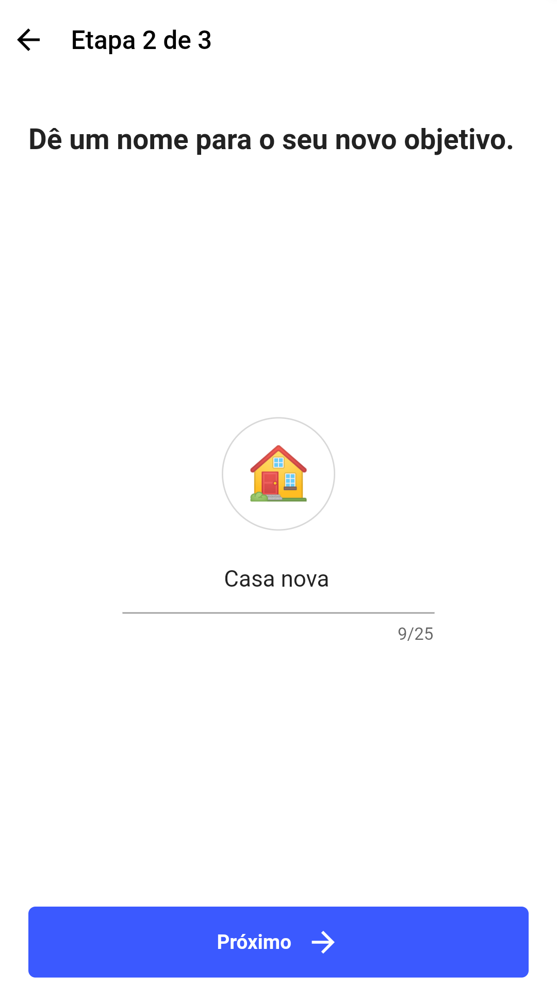

# Cofrinho Digital

Aplicativo de cofrinho digital feito com Flutter.

## Começando

Clone este repositório

```bash
git clone https://github.com/jpssantiago/cofrinho_digital
```

Instale as dependencias

```bash
flutter pub get
```

Rode o projeto :)

```bash
flutter run
```

## Images





## License
[MIT](LICENSE)